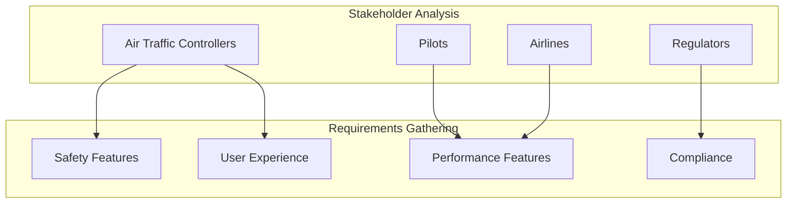
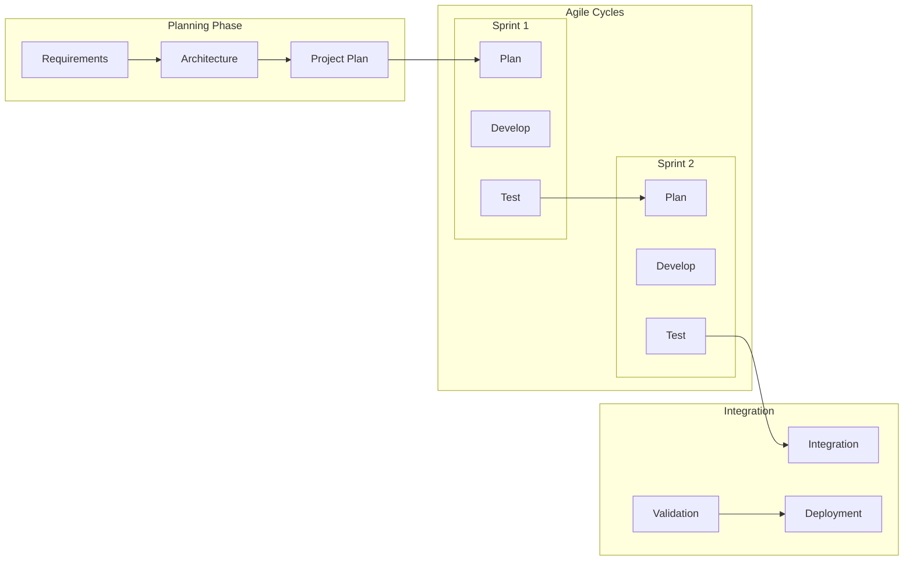
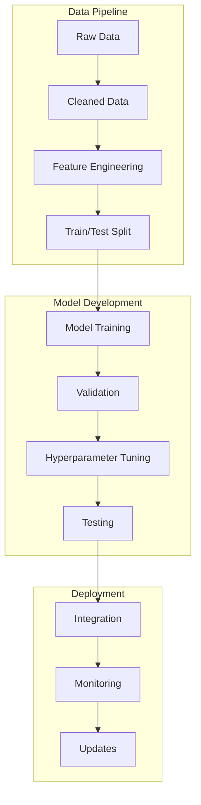
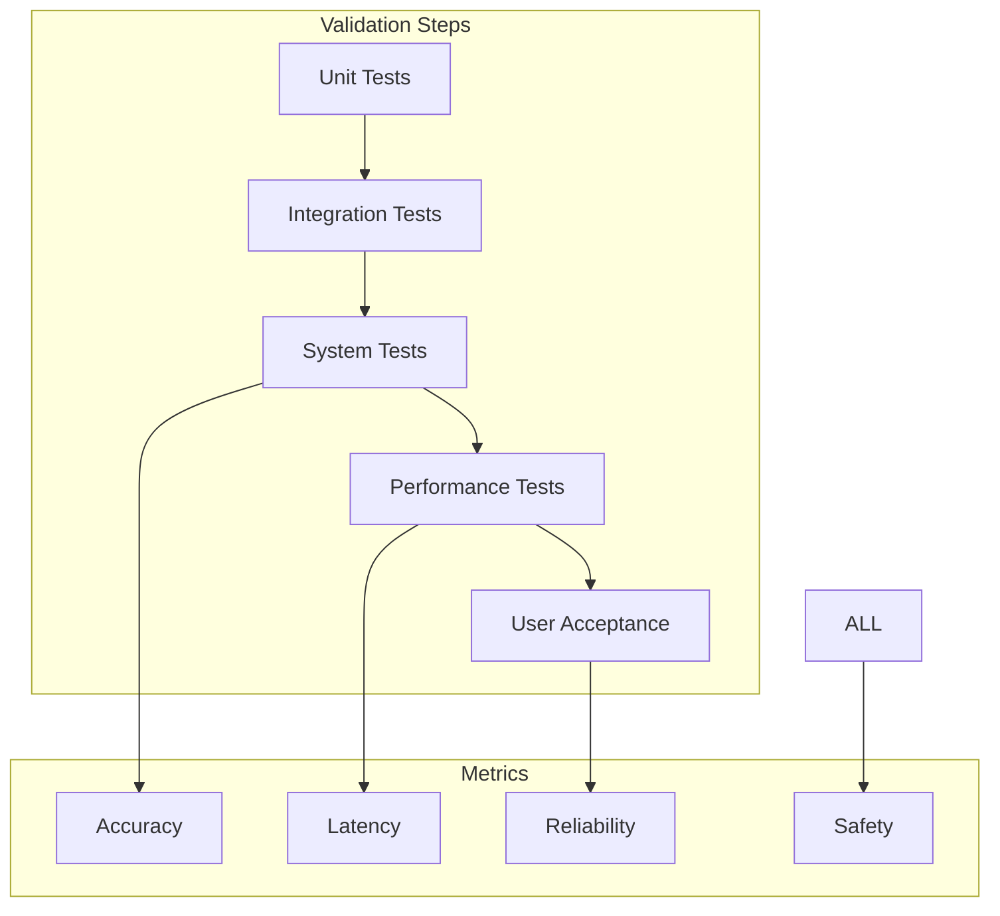
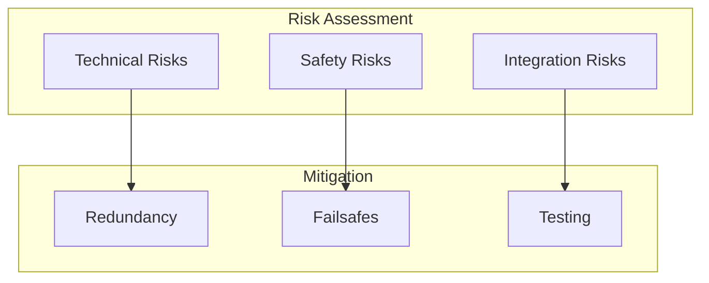
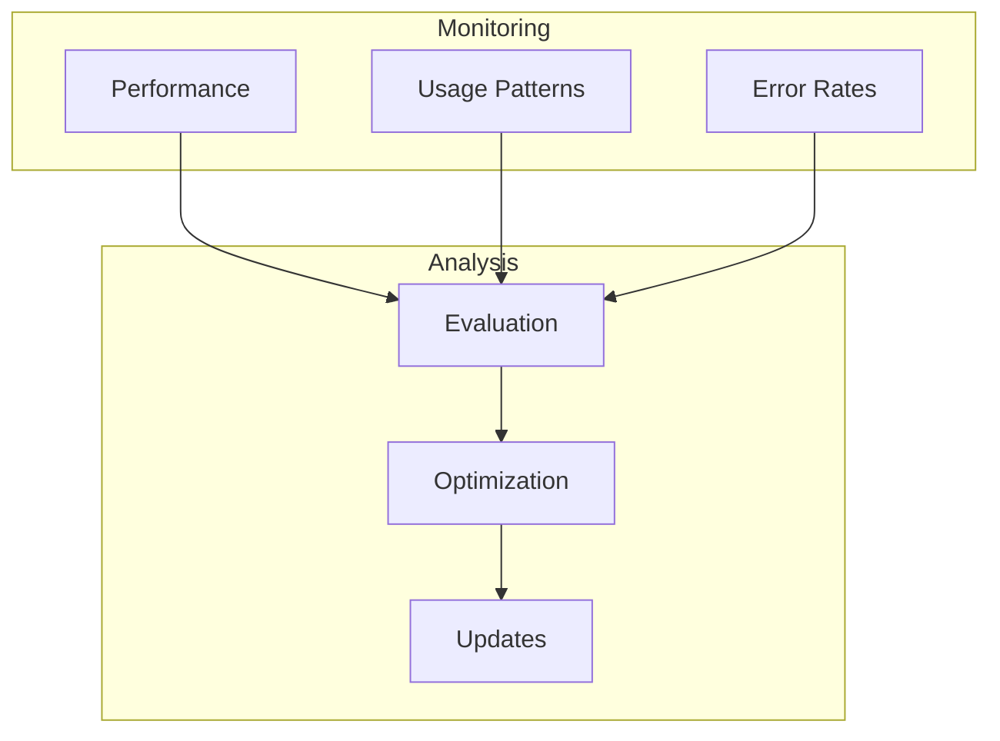

# Project Methodology: AI-Enhanced Air Traffic Control System

## 1. Research and Analysis Phase

### 1.1 Literature Review
- Study of existing ATC systems
- Analysis of AI applications in aviation
- Review of safety protocols
- Investigation of current limitations

### 1.2 Requirements Analysis

## 2. Development Methodology

### 2.1 Hybrid Agile-Waterfall Approach

## 3. AI Model Development Process

### 3.1 Data Collection and Preparation
1. **Historical Data Collection**
   - Flight trajectories
   - Weather patterns
   - Conflict scenarios
   - Emergency situations

2. **Data Processing**
   - Cleaning and normalization
   - Feature engineering
   - Validation splits
   - Augmentation

### 3.2 Model Development Workflow

## 4. Testing Methodology

### 4.1 Testing Layers
1. **Unit Testing**
   - Individual component testing
   - AI model validation
   - API endpoint testing

2. **Integration Testing**
   - Component interaction testing
   - Data flow validation
   - System integration

3. **System Testing**
   - End-to-end testing
   - Performance testing
   - Stress testing

### 4.2 Validation Process

## 5. Implementation Strategy

### 5.1 Phased Implementation
1. **Phase 1: Core Functions**
   - Basic trajectory prediction
   - Simple conflict detection
   - Basic user interface

2. **Phase 2: AI Integration**
   - LSTM implementation
   - CNN weather analysis
   - Initial ML models

3. **Phase 3: Advanced Features**
   - War zone routing
   - Emergency handling
   - Advanced optimization

### 5.2 Risk Mitigation

## 6. Validation and Verification

### 6.1 Model Validation
- Cross-validation techniques
- Historical data comparison
- Expert system validation
- Safety verification

### 6.2 System Verification
- Functionality testing
- Performance verification
- Safety compliance
- Regulatory compliance

## 7. Continuous Improvement

### 7.1 Feedback Loop

### 7.2 Update Process
- Regular model retraining
- Performance optimization
- Feature updates
- Security patches

This methodology ensures systematic development, thorough testing, and continuous improvement of the ATC system while maintaining focus on safety and reliability.