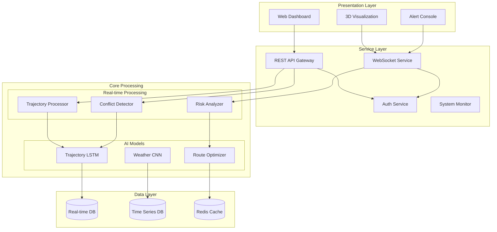
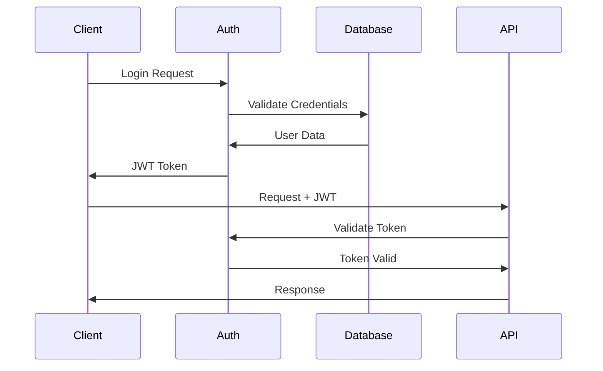
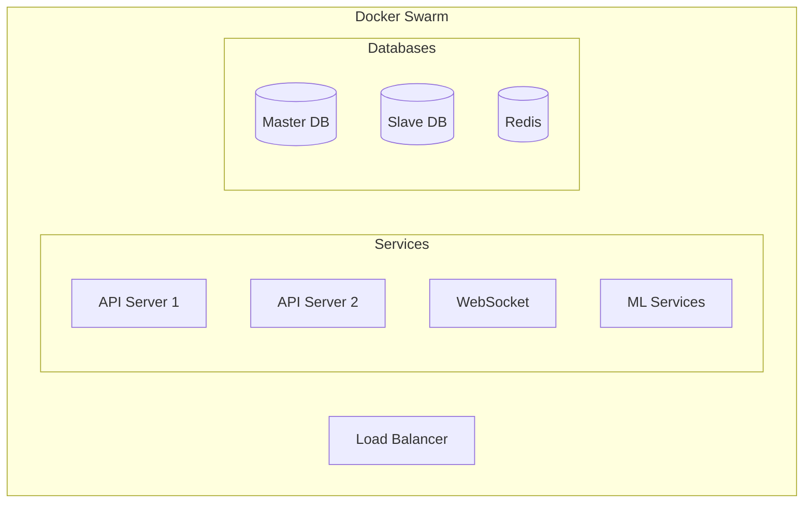

# Detailed System Design: AI-Powered Air Traffic Control System

## 1. System Architecture



## 2. Component Architecture

### 2.1 Frontend Components
- **Controller Dashboard**: React-based SPA
- **3D Visualization**: WebGL/Three.js
- **Alert System**: WebSocket-based real-time notifications
- **Command Interface**: REST API client

### 2.2 Service Layer
- **API Gateway**: FastAPI with async support
- **WebSocket Server**: ASGI-based real-time communication
- **Authentication**: JWT with OAuth2
- **System Monitor**: Prometheus/Grafana

### 2.3 Core Processing Units
1. **Trajectory Processor**
   - State estimation
   - Path prediction
   - Conflict projection

2. **Conflict Detector**
   - Separation monitoring
   - Risk calculation
   - Alert generation

3. **Risk Analyzer**
   - Multi-factor analysis
   - Priority assessment
   - Resolution generation

### 2.4 AI/ML Components
1. **LSTM Network**
   - Architecture: Many-to-Many sequence
   - Input: Position, velocity, weather
   - Output: Future trajectories

2. **CNN Weather Analyzer**
   - Input: Weather radar data
   - Output: Impact predictions
   - Real-time updates

3. **Reinforcement Learning**
   - Policy: Safety-first routing
   - Rewards: Efficiency vs. risk
   - Training: Simulated environments

## 3. Database Design

### 3.1 Real-time Database (PostgreSQL)
```sql
-- Aircraft State
CREATE TABLE aircraft_state (
    aircraft_id UUID PRIMARY KEY,
    position POINT,
    velocity VECTOR,
    altitude FLOAT,
    timestamp TIMESTAMPTZ
);

-- Flight Plans
CREATE TABLE flight_plans (
    plan_id UUID PRIMARY KEY,
    aircraft_id UUID,
    route GEOMETRY,
    departure TIMESTAMPTZ,
    arrival TIMESTAMPTZ
);
```

### 3.2 Time Series DB (TimescaleDB)
```sql
-- Trajectory Data
CREATE TABLE trajectories (
    time TIMESTAMPTZ NOT NULL,
    aircraft_id UUID,
    position POINT,
    altitude FLOAT
);

-- Weather Data
CREATE TABLE weather_conditions (
    time TIMESTAMPTZ NOT NULL,
    location POINT,
    conditions JSONB
);
```

## 4. API Design

### 4.1 REST Endpoints
```yaml
/api/v1:
  /aircraft:
    GET: Get all active aircraft
    POST: Add new aircraft
  /trajectories:
    GET: Get predicted trajectories
  /conflicts:
    GET: Get active conflicts
  /weather:
    GET: Get weather impact
```

### 4.2 WebSocket Events
```javascript
// Real-time Events
{
  "type": "POSITION_UPDATE",
  "data": {
    "aircraft_id": "uuid",
    "position": [lat, lon],
    "altitude": float
  }
}
```

## 5. Security Architecture

### 5.1 Authentication Flow


### 5.2 Data Security
- End-to-end encryption
- Role-based access control
- Audit logging
- Rate limiting

## 6. Deployment Architecture

### 6.1 Container Structure


### 6.2 Scaling Strategy
- Horizontal scaling for API servers
- Vertical scaling for ML components
- Read replicas for databases
- Load balancing across nodes

## 7. Performance Optimization

### 7.1 Caching Strategy
- In-memory cache for active flights
- Query result caching
- Session state caching
- Real-time data buffering

### 7.2 Performance Metrics
- Response time: < 100ms
- Update frequency: 1Hz
- Data consistency: Real-time
- System availability: 99.999%

## 8. Monitoring and Logging

### 8.1 Metrics Collection
- System health
- Performance metrics
- Error rates
- Resource utilization

### 8.2 Logging Strategy
- Centralized logging
- Error tracking
- Audit trails
- Performance monitoring