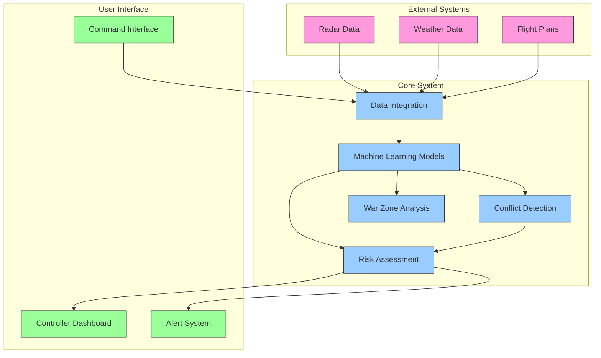
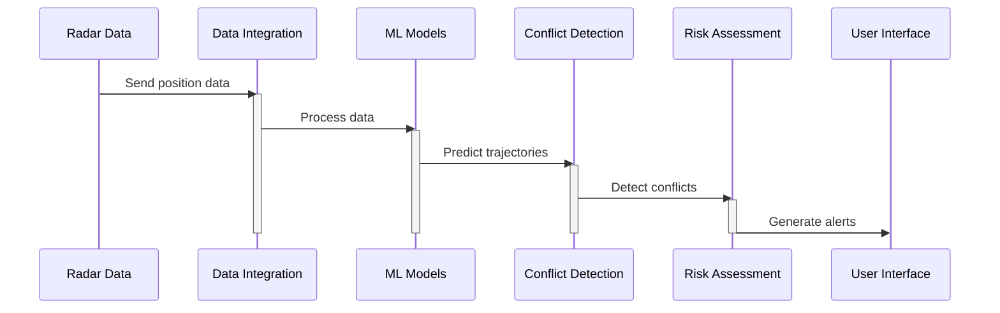
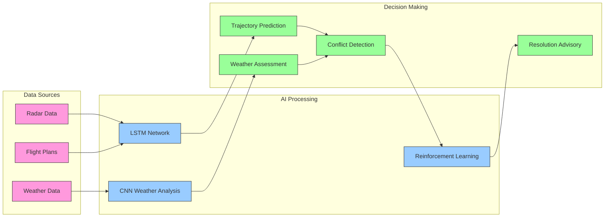
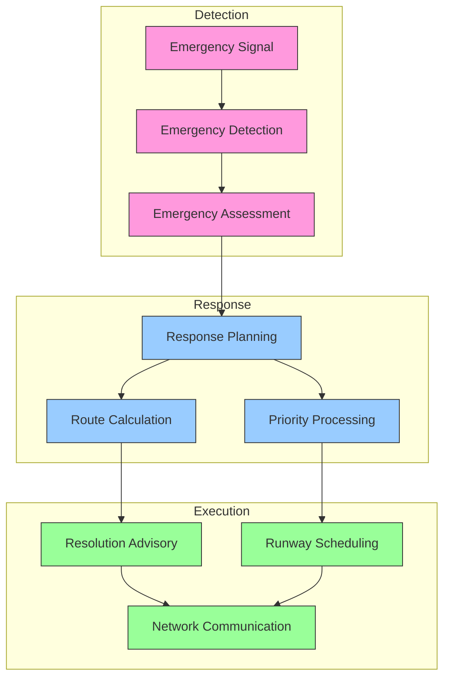
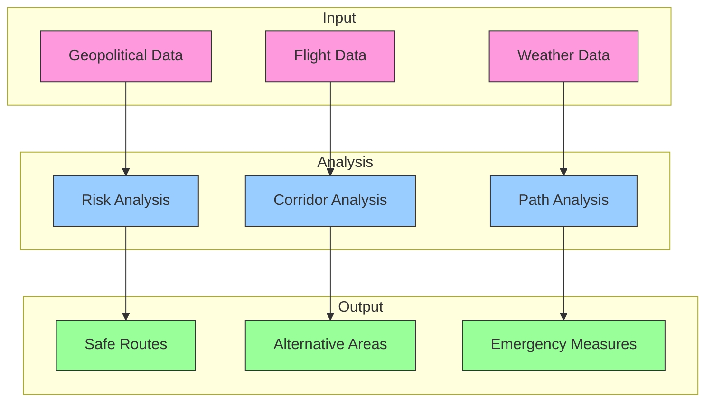
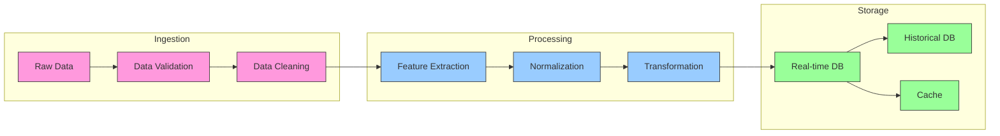

# ATC System Methodology Diagrams

## 1. System Components Interaction

## 2. Data Processing Sequence

## 3. AI Model Integration Flow

## 4. Emergency Handling Flow

## 5. War Zone Routing Process

## 6. Data Processing Pipeline

These diagrams provide a visual representation of:
1. System component interactions
2. Data processing sequences
3. AI model integration
4. Emergency handling procedures
5. War zone routing process
6. Data processing pipeline

Each diagram uses color coding:
- Pink: External/Input systems
- Blue: Core processing/Analysis
- Green: Output/Interface components