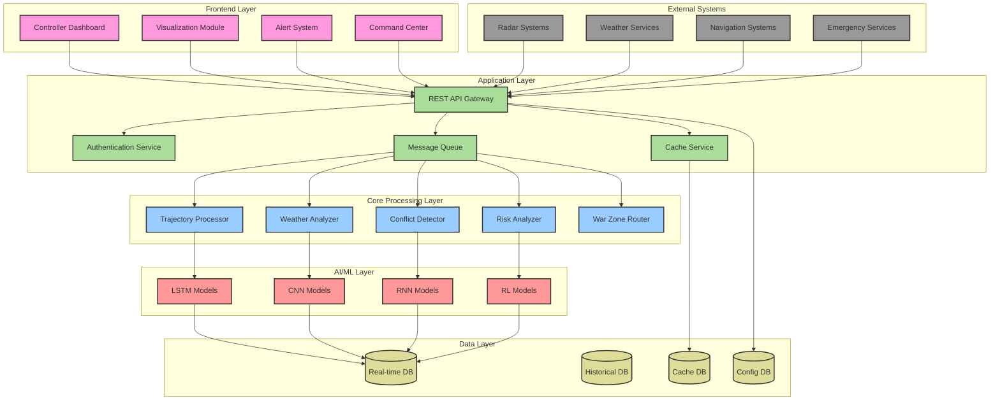

# Air Traffic Control System Design

## 1. High-Level System Architecture

## 2. Component Details

### 2.1 Frontend Layer
- **Controller Dashboard**: Real-time aircraft monitoring and control
- **Visualization Module**: 2D/3D airspace visualization
- **Alert System**: Priority-based notification system
- **Command Center**: Control input and system management

### 2.2 Application Layer
- **REST API Gateway**: Handles all external communications
- **Authentication Service**: Security and access control
- **Cache Service**: Performance optimization
- **Message Queue**: Asynchronous task processing

### 2.3 Core Processing Layer
- **Trajectory Processor**: Aircraft path prediction
- **Conflict Detector**: Collision risk assessment
- **Risk Analyzer**: Safety evaluation
- **Weather Analyzer**: Weather impact assessment
- **War Zone Router**: Safe route planning

### 2.4 AI/ML Layer
- **LSTM Models**: Trajectory prediction
- **CNN Models**: Weather pattern analysis
- **RNN Models**: Conflict prediction
- **RL Models**: Route optimization

### 2.5 Data Layer
- **Real-time DB**: Current system state
- **Historical DB**: Past flight data
- **Cache DB**: Temporary data storage
- **Config DB**: System configuration

### 2.6 External Systems
- **Radar Systems**: Position tracking
- **Weather Services**: Weather updates
- **Navigation Systems**: Flight planning
- **Emergency Services**: Crisis management

## 3. Technical Specifications

### 3.1 Technologies Used
- **Frontend**: React, WebGL, D3.js
- **Backend**: Python, FastAPI
- **AI/ML**: TensorFlow, PyTorch
- **Databases**: PostgreSQL, Redis
- **Message Queue**: RabbitMQ
- **Cache**: Redis
- **Authentication**: JWT, OAuth2

### 3.2 System Requirements
- **Processing**: Multi-core servers
- **Memory**: 64GB+ RAM
- **Storage**: SSD/NVMe
- **Network**: Low-latency, redundant connections
- **GPU**: NVIDIA for AI processing

### 3.3 Performance Metrics
- **Response Time**: < 100ms
- **Update Frequency**: 1Hz
- **Data Processing**: Real-time
- **Scalability**: Up to 1000 aircraft
- **Availability**: 99.999%

## 4. Security Architecture

### 4.1 Security Layers
- API Gateway security
- JWT authentication
- Role-based access control
- Data encryption
- Audit logging

### 4.2 Backup Systems
- Real-time data replication
- Disaster recovery
- Failover systems
- Redundant processing

## 5. Integration Points

### 5.1 External APIs
- Radar data integration
- Weather service API
- Navigation system interface
- Emergency services connection

### 5.2 Internal APIs
- Inter-service communication
- Data synchronization
- Event messaging
- Status monitoring

This system design provides a comprehensive view of the ATC system's architecture, focusing on technical components and their interactions while maintaining separation from the methodology aspects.